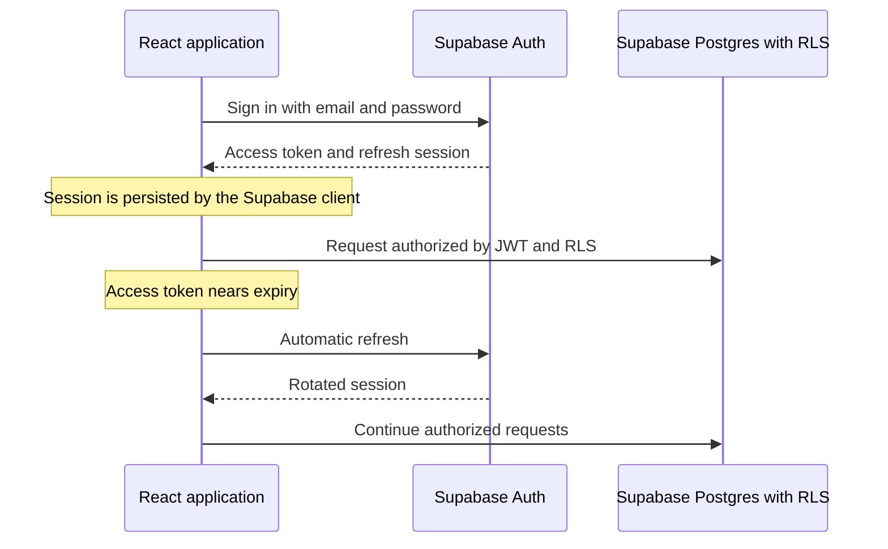

# Persistent authentication architecture

## Executive summary

SplitMate uses one Supabase browser client for authentication, database access,
private storage, and realtime updates. Supabase persists and refreshes the
session in browser storage, so closing a normal tab does not sign the user out.
Only the explicit sign-out action clears the local session.

Existing InsForge users are migrated with their UUIDs and supported bcrypt
password hashes. They do not create new accounts. At cutover they sign in once
with their existing email and password because tokens issued by one provider
cannot be transferred to another provider.

## Root causes found

1. Authentication had two competing token lifecycles: custom browser storage
   and the InsForge SDK.
2. The SDK build used by the app did not implement the configured persistent
   session behavior.
3. Cross-site refresh cookies were unreliable in privacy-focused and mobile
   browsers.
4. Route guards could render the login page before session restoration
   completed, making a valid session look logged out.

## Implemented design



### Storage responsibilities

| Data | Location | Purpose |
|---|---|---|
| Supabase session | Browser local storage under `splitmate-supabase-auth` | Durable sign-in and automatic refresh |
| Access token | Managed by Supabase client | Authorize database, storage, and realtime requests |
| User profile | `public.users`, protected by RLS | Application identity and role |

XSS prevention remains important because a browser-managed persistent session
is JavaScript-readable. No privileged or server-only key is shipped to the app.

## Lifecycle behavior

- App startup waits for `getSession()` before protected routes render.
- `onAuthStateChange` keeps application state synchronized with token refreshes.
- `persistSession` and `autoRefreshToken` remain enabled.
- Closing and reopening a normal tab restores the same session.
- Only the explicit sign-out action calls Supabase `signOut()`.

## Security boundary

Persistent login never replaces authorization. All nine application tables have
RLS, storage buckets are private, and receipt/avatar access is checked against
group membership. Revoked sessions, cleared browser storage, private browsing,
or administrator action can still require a new login.

## Operational requirements

Set these environment variables in Vercel for Production, Preview, and Development:

```text
VITE_SUPABASE_URL=https://your-project.supabase.co
VITE_SUPABASE_PUBLISHABLE_KEY=sb_publishable_your_key
```

Production site URL: `https://flat-expense-calculator.vercel.app`

Allowed production redirects:

- `https://flat-expense-calculator.vercel.app/auth/callback`
- `https://flat-expense-calculator.vercel.app/reset-password`

These values must also be saved in the hosted Supabase Auth URL Configuration
before cutover.

## Interview explanation

> The original application had two competing token lifecycles and depended on
> cross-site refresh behavior that was unreliable on mobile browsers. I moved
> auth, data, storage, and realtime to one Supabase client, enabled persisted
> auto-refreshing sessions, and protected every table and file with RLS. Existing
> user IDs and passwords were preserved, while the expense calculation logic was
> left unchanged.

## Research sources

- [Supabase JavaScript auth reference](https://supabase.com/docs/reference/javascript/auth-api)
- [Supabase sessions guide](https://supabase.com/docs/guides/auth/sessions)
- [Supabase row-level security guide](https://supabase.com/docs/guides/database/postgres/row-level-security)
