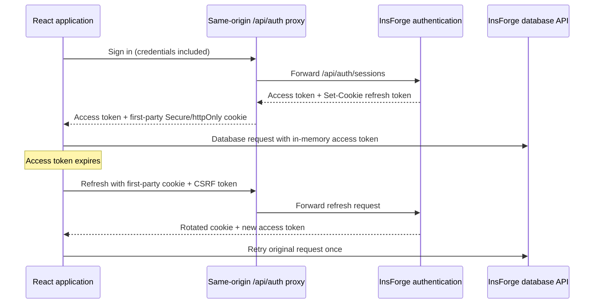

# Persistent authentication architecture

## Executive summary

SplitMate now uses a first-party, httpOnly refresh cookie in production. The browser receives that cookie from the app's own `/api/auth/*` origin, while a narrowly scoped Vercel function forwards authentication requests to InsForge. Access tokens remain short-lived and in memory. A small local snapshot keeps the interface recognizable during offline starts, but it is not treated as proof of authorization.

No database or SQL migration is required. Session issuance, rotation, expiry, and revocation belong to the InsForge authentication service rather than application tables.

## Root causes found

1. The project used `@insforge/sdk@1.1.6-dev.0`, an obsolete development build. It declared `autoRefreshToken` and `persistSession` configuration fields, but the shipped JavaScript did not use them.
2. Login bypassed the SDK and called `?client_type=mobile` directly. This created a second token lifecycle beside the SDK's own lifecycle.
3. The application stored access and refresh tokens in `splitmate-user`, while the SDK separately looked for `insforge-auth-token`. Those two sources could disagree.
4. The production frontend and InsForge backend are cross-site. Safari/WebKit blocks third-party cookies by default, so a backend refresh cookie may work in some browsers but disappear or be withheld on iPhone/iPad.
5. `/` always redirected to `/login`, even when a cached user existed. The Login page eventually redirected authenticated users again, but the intermediate screen looked like a logout.
6. A malformed database UUID error (`22P02`) was incorrectly treated as an authentication expiry and could trigger unnecessary refresh behavior.
7. Refresh operations were deduplicated only inside one tab. Two tabs could rotate the same refresh token at nearly the same time.

## Implemented design



### Storage responsibilities

| Data | Location | Purpose |
|---|---|---|
| Refresh token | Secure, httpOnly, first-party cookie | Durable authentication and token rotation |
| Access token | SDK memory | Authorize current database/storage/realtime requests |
| User and role snapshot | `localStorage` | Fast/offline UI restoration only |
| Old refresh token | Legacy snapshot temporarily | Migration for users signed in before this release |

The new login flow never writes a refresh token to JavaScript-readable storage. Existing legacy sessions continue through a compatibility path; the next normal sign-in migrates them to the cookie-backed flow.

## Lifecycle behavior

- App startup waits for session restoration before route guards run.
- Closing and reopening a normal browser tab restores through the first-party refresh cookie.
- Returning to a visible tab or reconnecting after an outage refreshes a stale session.
- Database requests that encounter an expired JWT refresh through the same-origin proxy and retry once.
- Web Locks serialize refresh rotation across tabs where supported.
- A `storage` event synchronizes explicit sign-in/sign-out state across tabs.
- Network and backend failures preserve the cached identity instead of deleting it.
- Only the explicit Sign out action clears the local snapshot and auth cookies.

## Security boundary

Keeping the interface signed in is different from granting authorization. If the account is revoked or the server rejects the refresh token, protected backend requests still fail safely even though the offline user snapshot remains. Private browsing, manually clearing site data, browser storage eviction, or an administrator revoking the account cannot be overridden by frontend code.

The proxy is not a general-purpose relay. It accepts only the `/api/auth/*` route family, forwards only `insforge_*` cookies, removes upstream cookie `Domain` attributes, disables caching, and never exposes the refresh token to React.

## Operational requirements

Set these environment variables in Vercel for Production, Preview, and Development:

```text
VITE_INSFORGE_URL=https://your-app.region.insforge.app
VITE_INSFORGE_ANON_KEY=your-public-anon-key
INSFORGE_URL=https://your-app.region.insforge.app
```

`INSFORGE_URL` and `VITE_INSFORGE_URL` should point to the same backend. `INSFORGE_URL` exists separately so the server-side proxy does not depend on a browser-prefixed variable.

## Interview explanation

> The original application confused persistence with authorization. It saved tokens in local storage, but the SDK and the app each owned a different token lifecycle, and Safari blocked the cross-site refresh cookie. I upgraded to the stable SDK, moved refresh-token ownership to a first-party httpOnly cookie through a narrow Vercel auth proxy, kept access tokens in memory, serialized refreshes across tabs, and retained only a non-authoritative user snapshot for offline UX. The result survives tab closure without weakening backend authorization or changing any expense calculation.

## Research sources

- [InsForge TypeScript authentication reference](https://docs.insforge.dev/sdks/typescript/auth)
- [Official InsForge JavaScript SDK](https://github.com/InsForge/InsForge-sdk-js)
- [WebKit: Full Third-Party Cookie Blocking](https://webkit.org/blog/10218/full-third-party-cookie-blocking-and-more/)
- [Vercel external-origin rewrites](https://vercel.com/docs/routing/rewrites)
- [Vercel Node.js Functions](https://vercel.com/docs/functions/runtimes/node-js)
